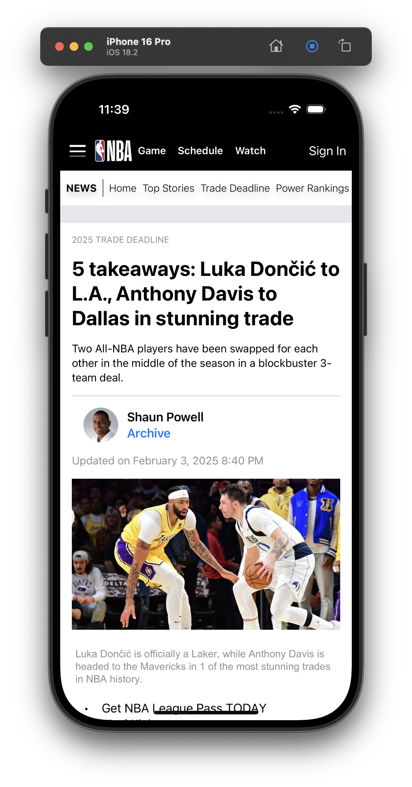
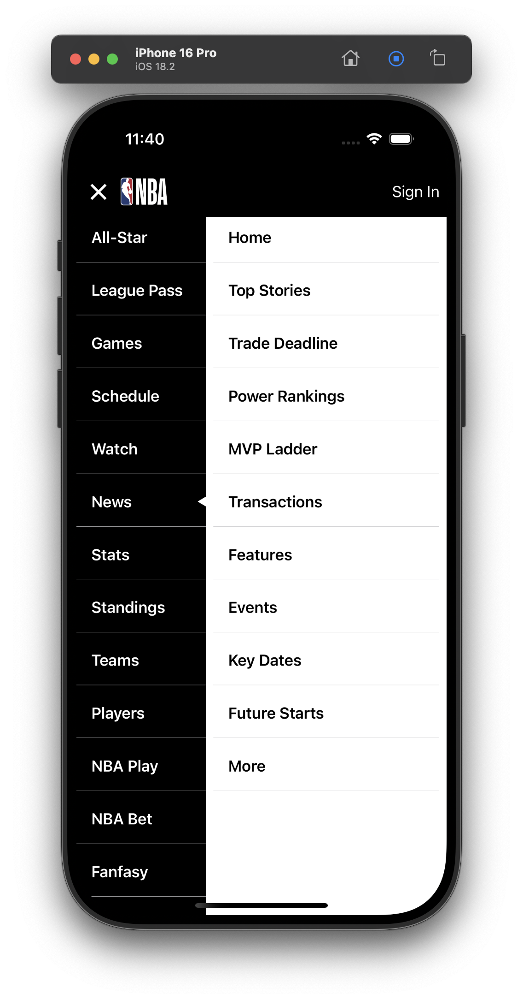

# NBA SwiftUI Project

## Introduction

This project is a simple demonstration of a responsive and user-friendly design using SwiftUI. The goal is to showcase my skills in SwiftUI development by replicating the content shown in the provided screenshot.

## Features

- Responsive layout that adapts to different screen sizes
- User-friendly design with refined styling
- Dummy content to demonstrate the layout and functionality

## Screenshots

### Home Screen



### Menu Screen



## Requirements

- macOS with Xcode installed
- Swift 5.0 or later
- iOS 15.0 or later

## Installation

To get started with this project, follow these steps:

1. **Clone the repository:**

   ```bash
   git clone https://github.com/fung626/bibliotheque-news-ios-app
   ```

2. **Navigate to the project directory:**

   ```bash
   cd bibliotheque-news-ios-app
   ```

3. **Open the project in Xcode:**
   ```bash
   open bibliotheque-news-ios-app.xcodeproj
   ```

## Running the Project

1. **Select the target device or simulator in Xcode.**
2. **Build and run the project:**
   - Click the "Run" button in Xcode, or use the shortcut `Cmd + R`.

## Design Ideas and Challenges

### Design Ideas

- **Responsive Design:** The layout adapts to different screen sizes using SwiftUI's `GeometryReader` and `VStack`/`HStack`.
- **Refined Styling:** Applied consistent color schemes, padding, and font styles to enhance the visual appeal.
- **Custom Components:** Created reusable components for menus and submenus to maintain a clean and modular codebase.

## Conclusion

This project demonstrates my ability to create a responsive, user-friendly design using SwiftUI. It showcases my skills in layout design, state management, and performance optimization. Feel free to explore the code and provide feedback!

## License

This project is licensed under the MIT License. See the [LICENSE](LICENSE) file for details.

## Contact

If you have any questions or suggestions, feel free to contact me at [fung626@gmail.com].
